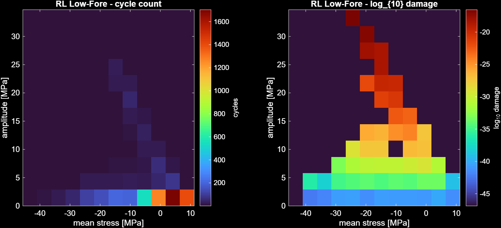
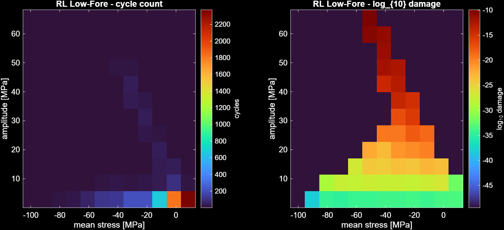
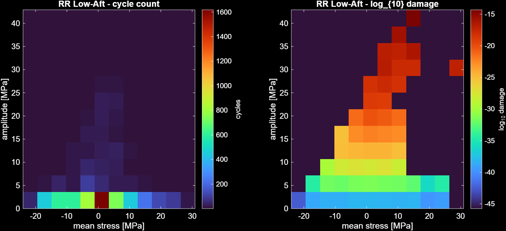

# Suspension Load Spectrum & Fatigue Pipeline

MATLAB tooling that converts a Formula Student car's logged accelerations into a
**per-member load spectrum** and a **fatigue assessment** for every suspension link
and chassis clevis.

Built for Team Bath Racing Electric, where I work as a Vehicle Dynamics and
Chassis Engineer. The toolchain runs two configurations from one codebase:

- **TBRe25** — the car the endurance telemetry was logged on: analysed
  end-to-end (its parameters, its geometry, its measured duty cycle).
- **TBRe26** — the car being built: validated against its published design
  loads, with the roll-stiffness (LLTD) load-transfer layer enabled, driven
  by the TBRe25 duty cycle as a **stated provisional** until TBRe26 running
  data exists. Every output prints that provenance banner.

---

## The problem

The team had a validated **quasi-static solver** that answers one question well:
*given this cornering/braking/bump case, how hard is each suspension link loaded?*
It was run for nine discrete design load cases to size the parts.

That sizes parts against a **single worst event**. It says nothing about **fatigue** —
parts failing after thousands of smaller load reversals rather than one big one.
This pipeline answers that second question.

---

## Method

**Objective** — per-member mean load, load-cycle count, cycle amplitude, and
accumulated fatigue damage over a real driving history.

**Approach**

1. Reformulate the team's corner solver as a **constant linear map**. The six-member
   force balance `A·f = b` has a geometry-only `A` and a `b` linear in the contact-patch
   force, so `f = M·[Fx Fy Fz]` with `M = −A⁻¹·[I; skew(r_cp)]` fixed per corner.
   Invert once at setup instead of every timestep.
2. Per timestep, compute tyre loads (the only nonlinearity — lateral force is
   distributed by each corner's vertical load, which itself contains transfer),
   then apply the cached map.
3. **Rainflow count** the resulting force history per member (ASTM E1049).
4. **Mean-stress correct** (Goodman or SWT), apply **Basquin S–N**, sum with
   **Miner's rule** to a design target of D = 0.5.

**Layer 2 — roll-stiffness load transfer.** The base solver splits lateral transfer
front/rear by track width alone (≈50/50). Replacing this with the team's measured
roll-stiffness distribution (LLTD ≈ 0.46 front) redistributes load rearward. Switchable
via `useRollStiffness` so the baseline behaviour is preserved.

**Outputs** — per-member fatigue table, per-member load spectrum, 2D rainflow matrices
(amplitude × mean) with damage matrices and damage-equivalent load, and a direct
comparison of the two load-transfer models.

---

## Validation

Cross-validated against the team's published member loads across all ten design load
cases, in two stages:

| Stage | Result |
|---|---|
| Load transfer (tyre loads) | **exact — 0.00%** on all ten cases |
| Member forces, front corner | **0.5% median** |
| Member forces, rear corner | **0.6% median** |

The linear-map reformulation reproduces the original `A\b` solve to **~4×10⁻¹¹ N**
over 10,000 randomised load vectors, while running roughly **500× faster** over a
telemetry-length history.

An initial ~20% discrepancy on the upper links was **not** a solver error — it was
traced to a superseded hardpoint revision, which led to the findings below.

**Physical anchor.** The one physical fatigue test available (a wishbone-insert
specimen, fully reversed, run-out with no damage) is used in the **force domain**:
comparing test amplitude directly against the rainflow force spectrum bypasses both
the stress-calibration placeholder and the material-data scatter. The test amplitude
exceeds the largest amplitude the worst-loaded member produces in service by ~1.8×,
and anchoring an S–N curve on it (borrowing only the literature slope) bounds insert
life at thousands of endurance events even on the pessimistic all-cycles-at-peak
assumption.

---

## Findings

Three defects surfaced in the existing toolchain during validation:

1. **Three conflicting hardpoint sets in circulation.** Two differ by 3.34° on the
   front upper-fore link and 1.41° on the pushrod. A third, hardcoded as a fallback
   inside the solver script, is up to **11.6°** from both — so running that script
   without explicitly supplying geometry silently produces wrong pushrod and
   tie-rod loads.
2. **Stale solver defaults.** The script ships with mass, front weight fraction and
   rear track values that do not reproduce the team's own reference load table.
3. **Rear track typo** in the kinematics sheet — a contact-patch coordinate implying
   a rear track 10% wider than every other source. Taken at face value it produces
   **21% errors** in rear member loads.

Engineering results:

- **Steel links are not the fatigue concern.** Peak amplitudes sit well below the
  endurance limit across a full endurance distance.
- **The aluminium chassis clevises are.** 7075 has no endurance limit, so it accrues
  damage on every cycle, and these parts were sized to a static safety factor but
  never fatigue-checked. They are the only population showing meaningful damage.
- **The rear works harder than the front** — roughly 2–3× the cycle amplitude on the
  upper links and tie rods, consistent with the measured LLTD.
- **The pushrods see the most reversals**, being the vertical load path.

---

## Assumptions and limitations

Stated plainly, because they bound what the numbers mean.

- **Quasi-static.** No inertial or damping terms. Partly mitigated by driving the
  model with measured accelerations, which already contain the transient content.
- **Vertical content is bandwidth-limited, not calibration-limited.** The logger
  samples at 20 Hz, so Nyquist is 10 Hz, while wheel hop for this car was **measured
  at 20–27 Hz** on a four-post rig (consistent with 8/13 kg unsprung corner masses
  against a rig-measured 185–191 N/mm tyre vertical rate). Kerb-strike and wheel-hop
  energy is therefore **aliased, not merely attenuated**, and cannot be recovered by
  any post-processing route.
  Measured spectra bear this out: damper position carries 94.7% of its energy below
  1 Hz and 0.1% in the 8–10 Hz band, while the chassis accelerometer's high-frequency
  content is broadband noise rather than structure.

  Deriving vertical tyre load from damper position **does** improve load estimation
  at ride and roll frequencies (~3.9 Hz), where the accelerometer route is poor — but
  it does not recover the kerb-strike spike. The only fix is a higher logging rate on
  the damper and accelerometer channels, which is a logger configuration decision that
  has to be made before a season rather than after it.

  Damper position is available in millimetres directly (`DPS` channels, p1–p99 spans
  of 22–29 mm against a 24.6 mm design spring travel), so no ADC calibration is
  required for this dataset.
- **Cycle counts are gate-sensitive.** Counting reversals requires a noise threshold.
  Across a plausible gate range the count varies several-fold, so counts are reported
  **with their gate**, which is set at 3× the measured sensor noise floor rather than
  chosen by eye. The tool prints the full sensitivity. Mean loads and amplitudes are
  far more robust than counts.
- **Members whose amplitude falls below the gate have unstable counts** and are
  flagged as such in the output.
- **Basquin/Miner/Goodman are metals methods.** They do not transfer to the CFRP
  suspension the team is moving to: composites need R-ratio-dependent S–N curves,
  are compression-governed rather than tension-governed, and typically fail at the
  bonded metallic insert rather than in the tube.
- **Clevis stress uses a placeholder scalar calibration** pending per-clevis
  unit-load FEA, and literature 7075 fatigue constants pending MMPDS data. The
  clevis *ranking* is meaningful; the absolute lives are not yet.
- **No tyre grip limit** in the solver. Acceptable when driven by measured
  accelerations, which are physically realisable by definition.

---

## Results

Run on a **21.5 km Formula Student endurance session** (34,481 moving samples at
20 Hz). Acceleration cycle counts at a gate of 0.30 g (3× the measured sensor
noise floor): **328 longitudinal / 848 lateral / 646 vertical**.

### TBRe25 — end-to-end (car matches telemetry)

- **Steel members: all negligible.** Worst damage RR pushrod; largest amplitude
  68 MPa (rear lower-fore) against a 108 MPa endurance limit — and the rear
  pullrod runs in tension while the front pushrod runs in compression, which
  Goodman penalises accordingly.
- **Aluminium clevises govern:** worst ~3.8×10⁴ endurance-run equivalents to the
  D = 0.5 design target at ~175 MPa peak notch stress (placeholder stress
  calibration — the ranking is meaningful, the absolute lives are not yet).
- **The rear works 2–4× harder than the front** — confirmed on two independent
  geometry sets, so it is load path (pullrod inclination, rear brake/traction
  share), not a data artefact.

### TBRe26 — validated configuration, LLTD layer on

- Larger tube sections cut peak steel amplitude to 40 MPa: everything steel is
  comfortably infinite-life.
- Clevises still govern (7.8×10⁴ blocks at 177 MPa, same placeholder caveat).
- **Roll-stiffness vs 50/50 load transfer:** peak member loads shift by −4.9% to
  **+5.1%**, systematically rearward — the simple split is non-conservative on
  the axle where the fatigue damage concentrates.
- Every output prints its duty-cycle provenance: TBRe25 telemetry as a stated
  provisional until TBRe26 running data exists.

Reproducibility: the full chain was independently re-implemented in a second
language and reproduces the MATLAB outputs exactly (damage sums to 4 significant
figures, stresses to 0.1 MPa) on the same input data.

## Figures

Both panels come from the same rainflow analysis of one member.

*Left: cycle count binned by amplitude and mean stress. Right: the damage each bin
contributes.* The hotspots are in **different places** — thousands of low-amplitude
cycles contribute almost nothing, while a handful of large ones dominate the damage.
With an S–N slope near 12, damage scales as roughly the 12th power of amplitude.
This is exactly why the count matrix alone is not enough, and why mean stress is
retained as a second dimension rather than averaged away.

*Members in compression (negative mean) show damage in clean horizontal bands, since
Goodman applies no tensile penalty. Members in tension show damage skewed toward the
high-mean corner. Same tool, visibly different physics.*

---

## Repository contents

| File | Purpose |
|---|---|
| `RUNALL_V2.m` | **TBRe25 entry point** — car matches the telemetry end-to-end |
| `RUNALL_TBRE26.m` | **TBRe26 entry point** — 26 hardware, LLTD layer on, provisional duty cycle |
| `RUN_ALLOY_FATIGUE_V2.m` | Aluminium deep-dive: clevis + wishbone-insert populations |
| `FatiguePipeline_V2.m` | Corner solver, load transfer, rainflow, S–N, Miner |
| `vd_load_spectrum.m` | Mean load, cycle count, amplitude per member |
| `rainflow_matrix.m` | 2D range–mean matrix, damage matrix, equivalent load |
| `alloy_fatigue.m`, `alloy_lib.m` | Aluminium S–N handling; documented material scatter |
| `tbre25_params_V2.m`, `tbre26_params_V2.m` | Per-car vehicle parameters |
| `tbre25_geometry.m`, `tbre26_geometry.m` | Hardpoints — **placeholder coordinates** (see data note) |

Open either `RUNALL_*.m` and press Run. With no data file set it runs on built-in synthetic
telemetry, so the repository is self-contained.

To run on logged data, set `DATA_FILE` to a CSV containing time, speed, yaw rate and
three acceleration channels. **Channel axes are resolved from physics, not from the
header names** — lateral by correlation against `V·r`, longitudinal against `dV/dt`,
vertical by which channel carries gravity. This is deliberate: in the logs this was
developed against, the channel names did not correspond to the axes they suggested,
and logger configuration changes between events.

---

## Note on data

**This repository contains code only.** Team geometry, load cases, setup data and
telemetry are TBRe confidential and are deliberately excluded.

Specifically not published: logged telemetry, suspension hardpoint coordinates, the
team's design load-case table, roll-dynamics and setup workbooks, and the team's own
solver source.

### Placeholder geometry

`default_geometry()` in `FatiguePipeline.m` contains **representative placeholder
hardpoints**, not the team's actual suspension coordinates. This is a substitution
made for publication only.

It does **not** affect any result reported here. Every figure in this README — the
validation percentages, the endurance load spectrum, the fatigue ranking — was
produced offline using the team's real hardpoints and real telemetry, supplied to
the pipeline at runtime via its CSV geometry argument. The published code path is
identical; only the default fallback coordinates differ.

The consequence for a reader is simply that running the repository as-is reproduces
the *method*, not the *numbers*, since neither the real geometry nor the telemetry
is distributed. Results are reported as findings; the underlying data is not.

---

## Status

Method complete and validated. Outstanding: composite (CFRP) fatigue formulation,
damper-derived vertical tyre load, 7075-T6 material data and per-clevis FEA
calibration.

Mahdi Kadiri — MEng Mechanical Engineering (Automotive), University of Bath
